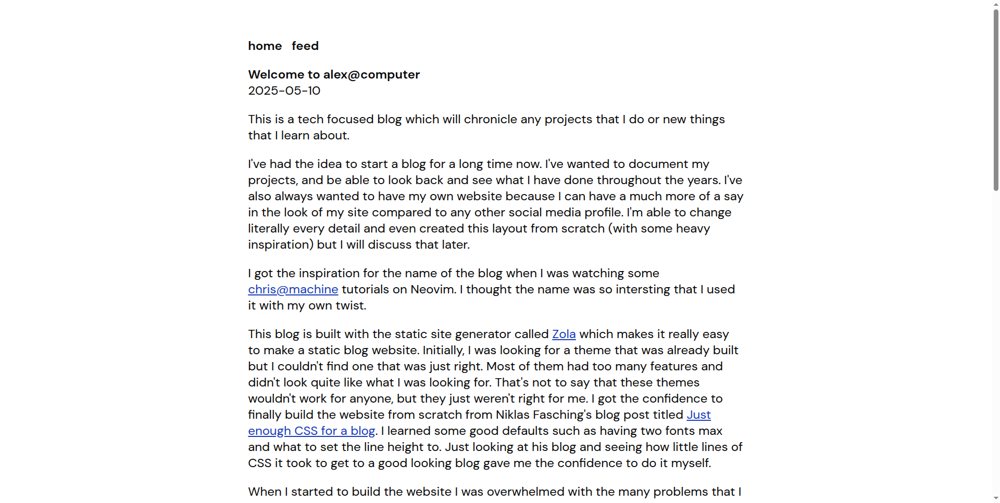

+++
title = "Welcome to alex@computer"
description = "An introduction to the site and the making of it."
+++

This is a tech focused blog which will chronicle any projects that I do or new things that I learn about.

I've had the idea to start a blog for a long time now. I've wanted to document my projects, and be able to look back and see what I have done throughout the years. I've also always wanted to have my own website because I can have a much more of a say in the look of my site compared to any other social media profile. I'm able to change literally every detail and even created this layout from scratch (with some heavy inspiration) but I will discuss that later.

I got the inspiration for the name of the blog when I was watching some [chris@machine](https://www.youtube.com/@chrisatmachine) tutorials on Neovim. I thought the name was so interesting that I used it with my own twist.

This blog is built with the static site generator called [Zola](https://www.getzola.org/) which makes it really easy to make a static blog website. Initially, I was looking for a theme that was already built but I couldn't find one that was just right. Most of them had too many features and didn't look quite like what I was looking for. That's not to say that these themes wouldn't work for anyone, but they just weren't right for me. I got the confidence to finally build the website from scratch from Niklas Fasching's blog post titled [Just enough CSS for a blog](https://niklasfasching.de/posts/just-enough-css/). I learned some good defaults such as having two fonts max and what to set the line height to. Just looking at his blog and seeing how little lines of CSS it took to get to a good looking blog gave me the confidence to do it myself.

When I started to build the website I was overwhelmed with the many problems that I would need to solve in order to get a usable web layout. I would need to choose fonts, colors, make the layout responsive for mobile and desktop viewing and I would need a domain and a place to host it.

Choosing a font is probably the easiest thing to do but it took me many different tries to find the right font. Initially, I chose two fonts one being a serif font for headings and the other being a sans serif font for the text. However, the two fonts made it more busy than it should be and I decided on one font which was [DM Sans](https://fonts.google.com/specimen/DM+Sans).

Next I had to choose colors. Similar to when choosing a font I started out more complex and then ended up going with a far more simple design. I thought that since I use gruvbox in my terminal that It would be a good idea to make the website the same colors. While I liked the dark color scheme from gruvbox, the light theme doesn't work well in in the web. Instead I decided on a very simple light-mode only website (for now), and for any accent colors such as links I have used the tailwindcss colors.

Then came one of the most difficult parts which was choosing the layout and making it responsive. When choosing the layout of the site I went back and forth on how big I should make headings and the amount of padding I should use. But when I stumbled upon [Tom Preston-Werner's blog](https://tom.preston-werner.com/) it changed the way that I looked at blog layouts forever. It was so simple using the same font size for everything and only changing the font weight to establish hierarchy.

When making the website responsive to mobile and readable on web I learned the basics from [Dani Krossing's How to Make a Website Responsive tutorial](https://youtu.be/ZYV6dYtz4HA). This video introduced me to media queries and setting the max-width which is all that is needed for a basic responsive website.

Now there are still many problems with the website but I'm still proud of it. Below is a screenshot of what the blog looks like today to be an archive.

As of writing, I have not published the site but I have bought the domain [alexatcomputer.com](https://alexatcomputer.com).  This website's source is on a [GitHub repo](https://github.com/alexatcomputer/alexatcomputer.github.io) and I will use GitHub pages to host it. I shouldn't find any trouble setting it up but if I do I will write another blog post explaining my frustrations but hopefully that won't be the case.
